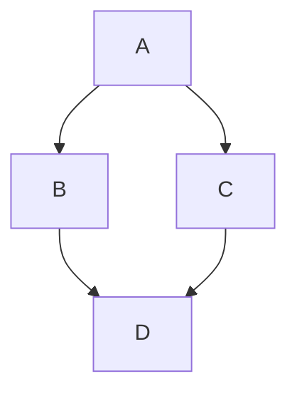

# @akashacms/diagram-makers

Process PlantUML, Mermaid, or Pintora, diagrams and either convert into an output file, or embed as HTML in a document.

## Supported diagramming systems

**PlantUML** https://plantuml.com/

These diagrams are rendered either by sending them to a PlantUML server (which is easy to self-host with Docker), or locally by running a copy of `plantuml.jar` with Java.  The JAR file is _not_ distributed with this package - a one-time setup step is required, described in the section _Setting up PlantUML rendering_ below.

**Mermaid** -- https://mermaid.ai/open-source/

These diagrams are rendered locally using a 3rd party Rust implementation of Mermaid that's packaged as WASM.  This means `@akashacms/diagram-makers` does not use the official Mermaid implementation, and there may be differences in behavior.  But, the Rust/WASM implementation is a lot faster, and avoids a dependency on Puppeteer.

Refer to the Mermaid website for language documentation.

**Pintora** -- https://pintorajs.vercel.app/

These diagrams are rendered in JavaScript using the Pintora package.

**NOTE**: It was intended that this package also support KaTeX.  Those who are interested (or not) should see [the issue queue entry](https://github.com/akashacms/plugins-diagrams/issues/7) for this task.

## VERSION NOTE - 0.10

This branch is for version 0.10 which is meant to correspond to AkashaRender 0.10

## INSTALL

In an AkashaCMS project directory:

```shell
$ npm install @akashacms/diagram-makers --save
```

## Setting up PlantUML rendering

Earlier releases of this package distributed a copy of `plantuml.jar`.  That file is large (over 1 MB), and not every user of this package renders PlantUML diagrams, so it is no longer included.  Instead, choose one of two setup paths:

1. Run a **PlantUML server**, most easily self-hosted with Docker, and set the `PLANTUML_SERVER_URL` environment variable.
2. Download **`plantuml.jar`**, using the included `plantuml-download` command, and set the `PLANTUML_JAR` environment variable.

If neither environment variable is set when a PlantUML diagram is rendered, rendering fails with an error message directing you to this section.

If both environment variables are set, the server is used.  The CLI options `--server` and `--jar` (described below) override the environment variables and select a specific backend.

### Option 1: PlantUML server

The PlantUML project publishes an official server image on Docker Hub.  Start it with:

```shell
$ docker run -d --name plantuml -p 8080:8080 plantuml/plantuml-server:jetty
```

Or with a Docker Compose file:

```yaml
services:
  plantuml:
    image: plantuml/plantuml-server:jetty
    ports:
      - "8080:8080"
    restart: unless-stopped
```

Then set the environment variable:

```shell
$ export PLANTUML_SERVER_URL=http://localhost:8080
```

Diagram text is deflate-compressed and encoded into the request URL using the [PlantUML text encoding](https://plantuml.com/text-encoding), then the rendered image is retrieved from the server.  Any server implementing the standard PlantUML server API can be used, including a server hosted elsewhere on your network.

The advantages of the server are: a) faster rendering, since the JVM is already running; b) no local Java requirement; c) the same server can back a local PlantUML editor.

Server rendering supports PNG (`tpng`), SVG (`tsvg`), and ASCII art (`ttxt`) output, with a single input file (or inline diagram) and a single output file per invocation.  The JAR-only features - other output formats, `darkmode`, multiple input files with `--output-dir` - report an error directing you to use the JAR.

### Option 2: Download plantuml.jar

The package includes a command that downloads the JAR from the [PlantUML releases page](https://github.com/plantuml/plantuml/releases):

```shell
$ npx diagram-makers plantuml-download --output-dir ~/plantuml
Downloading https://github.com/plantuml/plantuml/releases/download/v1.2026.6/plantuml-mit-1.2026.6.jar
Downloaded /home/me/plantuml/plantuml-mit-1.2026.6.jar
...
```

Then set the environment variable, as instructed by the command output:

```shell
$ export PLANTUML_JAR=/home/me/plantuml/plantuml-mit-1.2026.6.jar
```

By default the latest release of the MIT-licensed edition is downloaded.  The options:

```shell
Usage: diagram-makers plantuml-download [options]

Download the PlantUML JAR file for use with the PLANTUML_JAR environment variable

Options:
  --plantuml-version <version>  PlantUML version, such as 1.2025.0.  Default:
                                the latest release.
  --edition <edition>           JAR edition: gpl, mit, lgpl, asl, epl, bsd
                                (default: "mit")
  --output-dir <outDir>         Directory into which the JAR is downloaded
                                (default: ".")
```

The editions correspond to the license variants published by the PlantUML project.  Review the [PlantUML license page](https://plantuml.com/license) to choose the edition appropriate for your use.

**NOTE**: Rendering with the JAR requires the Java runtime to be installed on your machine and in your path.  You can test this by running `java --help` at the command line.  All `plantuml.jar` features are available in this mode, including all output formats, `darkmode`, and multiple input files.

## Usage - CLI -- PlantUML

The package includes a CLI tool with the following synopsis:

```shell
Usage: npx diagram-makers plantuml [options]

Render PlantUML files

Options:
  --input-file <inputFN...>  Path for document to render
  --output-file <outputFN>   Path for rendered document
  --server <serverURL>       URL for a PlantUML server.
                             Overrides PLANTUML_SERVER_URL.
  --jar <jarPath>            Path for a plantuml.jar file.
                             Overrides PLANTUML_JAR.
  --charset <charset>        To use a specific character set. Default: UTF-8
  --darkmode                 To use dark mode for diagrams
  --debugsvek                To generate intermediate svek files
  --filename <fileNm>        "example.puml" To override %filename% variable
  --nbthread <nThreads>      To use (N) threads for processing.
                             Use "auto" for 4 threads.
  --nometadata               To NOT export metadata in PNG/SVG generated files
  --output-dir <outDir>      To generate images in the specified directory
  --teps                     To generate images using EPS format
  --thtml                    To generate HTML file for class diagram
  --tlatex                   To generate images using LaTeX/Tikz format
  --tpdf                     To generate images using PDF format
  --tpng                     To generate images using PNG format (default)
  --tscxml                   To generate SCXML file for state diagram
  --tsvg                     To generate images using SVG format
  --ttxt                     To generate images with ASCII art
  --tutxt                    To generate images with ASCII art
                             using Unicode characters
  --tvdx                     To generate images using VDX format
  --txmi                     To generate XMI file for class diagram
  --verbose                  To have log information
  -h, --help                 display help for command
```

Most of these options correspond directly to the CLI arguments for `plantuml.jar` as listed on the PlantUML website.

Rendering requires either a PlantUML server or a downloaded JAR, as described in the section _Setting up PlantUML rendering_.  The backend is selected by the `PLANTUML_SERVER_URL` or `PLANTUML_JAR` environment variables, or overridden by the `--server` or `--jar` options.

One mode is a single input file, and a single output file:

```shell
$ npx diagram-makers plantuml \
      --input-file flight.puml \
      --output-file flight.png  \
      --tpng
```

This converts the PlantUML diagram in the named file into a PNG.

When `--output-file` is not given, the rendered output is written to standard output, so the command can be used in a pipeline:

```shell
$ npx diagram-makers plantuml \
      --input-file flight.puml --tsvg > flight.svg
```

The `--input-file` parameter can be used multiple times.  In that case, the parameters are treated as the `[file/dir] [file/dir] [file/dir]` parameters for `plantuml.jar`.  The `--output-file` parameter, if given, is ignored in this case.  You may use the `--output-dir` parameter to affect where the files land.

```shell
$ npx diagram-makers plantuml \
    --input-file file1.puml --input-file dir/with/diagrams \
    --output-dir out
    --tpng
```

This will search for PlantUML documents in the named files or directories, generating PNG files, with the files landing in a directory hierarchy under the `out` directory.  The multiple input file mode requires the JAR - it is not supported by server rendering.

## USAGE - CLI - Pintora

The package includes the following CLI commands to use Pintora.

```shell
$ npx diagram-makers pintora --help
Usage: diagram-makers pintora [options]

Render Pintora files

Options:
  --input-file <inputFN>    Path for document to render
  --output-file <outputFN>  Path for rendered document
  --pixel-ratio <ratio>
  --mime-type <mt>          MIME type for output file
  --bg-color <color>        String describing background color
  --width <number>          Width of the output, height will be calculated according to the diagram content ratio
  -h, --help                display help for command
```

The only mode is to render a single input file to an output file:

```shell
$ npx diagram-makers pintora \
      --input-file flight.pintora \
      --output-file flight.png  \
      --mime-type image/png
```

The `--mime-type` option selects between `image/svg+xml`, `image/jpeg`, or `image/png`.

## USAGE - CLI - Mermaid

The package includes the following CLI command to use Mermaid.  Rendering uses [mermaid-wasm-renderer](https://github.com/akashacms/mermaid-wasm-renderer), a WebAssembly build of a native Mermaid renderer ([mermaid-rs-renderer](https://github.com/1jehuang/mermaid-rs-renderer)).  It runs in-process, requiring neither a browser nor Puppeteer, and renders diagrams in milliseconds.

```shell
$ npx diagram-makers mermaid --help
Usage: diagram-makers mermaid [options]

Render Mermaid files to SVG

Options:
  --input-file <inputFN>    Path for document to render
  --output-file <outputFN>  Path for rendered SVG document
  --config <configFN>       Path for a JSON config file (theme, themeVariables,
                            flowchart, ...)
  --theme <theme>           Theme preset: default, dark, forest, neutral, or
                            modern
  --font <fontFN...>        TTF/OTF font file(s) to register for text
                            measurement
  -h, --help                display help for command
```

The only mode is to render a single input file to an output file.  Only SVG output is supported, and the output file name must have a `.svg` extension:

```shell
$ npx diagram-makers mermaid \
      --input-file flow.mmd \
      --output-file flow.svg
```

The [examples directory](./examples/) contains `flow.mmd`, `sequence.mmd`, and `class.mmd` along with their rendered SVG files, plus the `mermaid-config.json` discussed below.

The `--theme` option selects one of the built-in theme presets: `default`, `dark`, `forest`, `neutral`, or `modern`.

The `--config` option names a JSON file for fine-grained control over rendering.  It uses the same schema as the [mmdr](https://github.com/1jehuang/mermaid-rs-renderer) `--config` file, for example:

```json
{
  "themeVariables": {
    "primaryColor": "#F8FAFF",
    "fontFamily": "Inter, system-ui, sans-serif",
    "fontSize": 13
  },
  "flowchart": {
    "nodeSpacing": 50,
    "rankSpacing": 50
  }
}
```

A theme named with `--theme` takes precedence over the config file's `theme` setting, but is applied before `themeVariables`, so individual variable overrides still win.

```shell
$ npx diagram-makers mermaid \
      --input-file flow.mmd \
      --output-file flow.svg \
      --theme dark \
      --config mermaid-config.json
```

Because the renderer runs in WebAssembly, it cannot discover system fonts on its own.  By default a common system font is located and registered automatically for exact text measurement, falling back to calibrated approximate metrics when none is found.  The `--font` option overrides this by naming one or more TTF/OTF font files to use instead:

```shell
$ npx diagram-makers mermaid \
      --input-file flow.mmd \
      --output-file flow.svg \
      --font /usr/share/fonts/truetype/dejavu/DejaVuSans.ttf
```

A good source of freely licensed fonts is the [Google Fonts](https://fonts.google.com/) project.  To download a font, browse to its page, click _Get font_, then _Download all_, and unpack the resulting ZIP file, which contains the TTF files.  Fonts can also be fetched directly from the [Google Fonts GitHub repository](https://github.com/google/fonts), for example:

```shell
$ curl -L -o Roboto.ttf \
    'https://github.com/google/fonts/raw/main/ofl/roboto/Roboto%5Bwdth,wght%5D.ttf'
$ npx diagram-makers mermaid \
      --input-file flow.mmd \
      --output-file flow.svg \
      --font Roboto.ttf \
      --config mermaid-config.json
```

For the font to take effect, the `fontFamily` in the config file (or the theme default) should name the font family, such as `"fontFamily": "Roboto, sans-serif"`.  The first registered font also serves as the fallback for generic families like `sans-serif`.

<!-- ## USAGE - CLI - KaTeX -->

## API - PlantUML

The `diagram-makers` package exports an API providing similar functionality.

```js
import { doPlantUMLOptions, doPlantUML } from '@akashacms/diagram-makers';

await doPlantUML({
  inputBody: `
    @startuml
    ... diagram
    @enduml
    `,
  outputFN: '/path/to/destination/diagram.png',
  tpng: true
} as doPlantUMLOptions);
```

This converts an inline diagram into a PNG file at the named filesystem location.  The structure of the _options_ parameter is described by `doPlantUMLOptions`.

The `doPlantUML` function selects the rendering backend as described in _Setting up PlantUML rendering_: a PlantUML server when `PLANTUML_SERVER_URL` is set, a local JAR when `PLANTUML_JAR` is set, otherwise it throws an error.  The `serverURL` and `jarPath` options override the corresponding environment variables.

The backends are also exported directly:

* `doPlantUMLServer(options)` - renders through a PlantUML server.  The server URL comes from the `serverURL` option or `PLANTUML_SERVER_URL`.
* `doPlantUMLLocal(options)` - renders by running `plantuml.jar` with Java.  The JAR path comes from the `jarPath` option or `PLANTUML_JAR`.
* `plantumlEncode(diagram)` - returns the [PlantUML text encoding](https://plantuml.com/text-encoding) of the diagram text, for constructing PlantUML server URLs yourself.

The `inputFNs` is an array treated similarly to the `--input-file` parameter for the CLI.

There are three modes for treating inputs and outputs:

* No `inputFNs`, in which case `inputBody` is the diagram source.
* One entry in the `inputFNs`, which is the diagram source.
* Multiple entries in the `inputFNs`, and the output location is influenced by `outputDir`.  This mode requires the JAR backend.

In the first two modes, the rendered output is written to `outputFN` when given, and returned as a `Buffer` otherwise:

```js
const svg = (await doPlantUML({
  inputBody: '@startuml ... @enduml',
  tsvg: true
})).toString('utf-8');
```

## API - Mermaid

The `doMermaid` function renders a Mermaid diagram into an SVG file:

```js
import { MermaidRenderOptions, doMermaid } from '@akashacms/diagram-makers';

await doMermaid({
  code: `
    flowchart LR
    A[Start] --> B[End]
    `,
  outputFN: '/path/to/destination/diagram.svg'
} as MermaidRenderOptions);
```

The structure of the _options_ parameter is described by `MermaidRenderOptions`:

* `code` - Required.  The Mermaid diagram text.  Unlike `doPlantUMLLocal`, there is no input file mode - read the file first, for example with `fsp.readFile(inputFN, 'utf-8')`.
* `outputFN` - Required.  The file into which the SVG is written.  Only SVG output is supported.
* `configJSON` - Optional.  A JSON _string_ (not a file name) using the same configuration schema shown in the CLI section (`theme`, `themeVariables`, `flowchart`, ...).
* `themePreset` - Optional.  One of `default`, `dark`, `forest`, `neutral`, or `modern`.  Takes precedence over the config's `theme` setting, but is applied before `themeVariables`.
* `fontFNs` - Optional.  An array of TTF/OTF font file names to register for exact text measurement.  When omitted, a common system font is located and registered automatically, falling back to calibrated approximate metrics when none is found.

For example, using a configuration and a specific font:

```js
import { promises as fsp } from 'node:fs';
import { doMermaid } from '@akashacms/diagram-maker';

await doMermaid({
  code: await fsp.readFile('flow.mmd', 'utf-8'),
  outputFN: 'flow.svg',
  configJSON: await fsp.readFile('mermaid-config.json', 'utf-8'),
  themePreset: 'dark',
  fontFNs: [ 'Roboto.ttf' ]
});
```

Rendering happens in-process through [mermaid-wasm-renderer](https://github.com/akashacms/mermaid-wasm-renderer) - no browser or child process is involved.  Rendering errors, such as invalid diagram syntax or an unknown theme name, are thrown as ordinary `Error` objects.

## Usage - AkashaCMS project

The `@akashacms/diagram-makers` package includes an AkashaCMS plugin, as well as Markdown-IT plugins supporting Mermaid and PlantUML code fences.

Setup, configuration:

```js
import {
    DiagramsPlugin,
    MarkdownITMermaidPlugin,
    MarkdownITPlantUMLPlugin
} from '@akashacms/diagram-makers';

config.use(DiagramsPlugin);

config.findRendererName('.html.md')
.use(MarkdownITMermaidPlugin, {
    // All options are optional
    themePreset: 'forest',
    configJSON: await fsp.readFile('mermaid-config.json', 'utf-8'),
    fontFNs: [ '/path/to/Roboto.ttf' ]
})
.use(MarkdownITPlantUMLPlugin);
```

The options for `MarkdownITMermaidPlugin` are:

* `configJSON` - Optional.  A JSON _string_ (not a file name) using the same configuration schema shown in the CLI section (`theme`, `themeVariables`, `flowchart`, ...).
* `themePreset` - Optional.  One of `default`, `dark`, `forest`, `neutral`, or `modern`.  Takes precedence over the config's `theme` setting, but is applied before `themeVariables`.
* `fontFNs` - Optional.  An array of TTF/OTF font file names to register for exact text measurement.  When omitted, a common system font is located and registered automatically, falling back to calibrated approximate metrics when none is found.

In previous releases this plugin required `fspath` and `prefix` options naming a scratch directory.  Those options are no longer needed, and are ignored, because diagrams are now rendered directly to inline SVG (see below).

### PlantUML diagrams in AkashaCMS projects

In a document the `<diagrams-plantuml>` tag is used for rendering a single PlantUML diagram into either PNG or SVG.

Rendering requires either the `PLANTUML_SERVER_URL` or `PLANTUML_JAR` environment variable to be set when running the AkashaCMS build, as described in the section _Setting up PlantUML rendering_.

The PlantUML document can be used inline

```html
<diagrams-plantuml output-file="./flight.png" tpng>
@startuml
start

if (Graphviz installed?) then (yes)
  :process all 
  diagrams;
else (no)
  :process only 
  __sequence__ and __activity__ diagrams;
endif

stop
@enduml
</diagrams-plantuml>
```

The diagram is rendered into the AkashaCMS `renderDestination` directory hierarchy to a location relative to the document being rendered.

Either the `tpng` or `tsvg` property (not attribute) is used to indicate the output format.

The diagram can also be in the filesystem:

```html
<diagrams-plantuml
    input-file="./img/flight.puml"
    output-file="./img/flight.png"
    tpng/>
<diagrams-plantuml
    input-file="/path/to/diagrams/flight.puml"
    output-file="./img/flight.png"
    tpng/>
```

The `input-file` path must be a virtual path within either an `assets` or `documents` directory.

If the `input-file` is an absolute pathname, it is relative to the root of the virtual filespace of the AkashaCMS project configuration.  A relative pathname is relative to the file being rendered.

The `output-file` attribute is optional.  When omitted, the rendered SVG is inserted inline in the generated HTML instead of being written to a file and referenced with ``:

```html
<diagrams-plantuml input-file="./puml-use-cases.puml" tsvg/>
```

Inline mode requires the `tsvg` output format - a PNG cannot be embedded this way.  The generated HTML is:

```html
<figure id="..." class="diagrams-plantuml ..." title="...">
<svg xmlns="http://www.w3.org/2000/svg" viewBox="..."
     style="background:#FFFFFF; max-width: ...px" role="img" aria-label="..."> ... </svg>
<figcaption>...</figcaption>
</figure>
```

In inline mode there is no `` element to carry the `alt`, `title`, and `width` attributes, so they are placed differently: `alt` becomes an `aria-label` on the SVG root (which is marked `role="img"` for accessibility), `width` becomes a `width` style on the SVG root, and `title` is placed on the `<figure>`.

In both modes the generated `<figure>` carries the `diagrams-plantuml` class, whose stylesheet rules constrain the diagram to its container, in the same manner as described for Mermaid in the section _Constraining diagram size on the web page_.

### PlantUML code fences in Markdown documents

With `MarkdownITPlantUMLPlugin` added to Markdown-IT as shown above, a PlantUML diagram can be written in a code fence, and is rendered as inline SVG:

    ```plantuml optional title goes here
    Alice -> Bob : hello
    ```

In other words, within a 3-backtick fence labeled with the language `plantuml`, you place a PlantUML document.  You may also use a three-tilde fence (`~~~plantuml`) if you prefer.

A figure caption can be included by adding a space after `plantuml` then adding the caption text.

When the diagram text does not begin with a `@start` line, it is automatically wrapped in `@startuml`/`@enduml`.  Diagram types requiring other markers, such as `@startmindmap` or `@startgantt`, spell those out and are passed through unchanged.

Behind the scenes the fence is converted into a `<diagrams-plantuml tsvg>` element, which is then rendered to inline SVG as described in the previous section.  Because PlantUML rendering is asynchronous (a PlantUML server request or a child Java process) while Markdown-IT rendering is synchronous, the actual rendering happens during Mahabhuta processing.  Consequently:

* This plugin requires the AkashaCMS rendering pipeline with `DiagramsPlugin` configured - unlike `MarkdownITMermaidPlugin`, it does not work with standalone Markdown-IT.
* The PlantUML rendering backend must be configured, as described in the section _Setting up PlantUML rendering_.

### Pintora diagrams in an AkashaCMS project

In a document the `<diagrams-pintora>` tag is used for rendering a single Pintora diagram into PNG, JPEG, or SVG.

The Pintora document can be used inline

```html
<diagrams-pintora output-file="./flight.png" mime-type="image/png">
sequenceDiagram
  Frida-->>Georgia: Flowers are beautiful
  @note over Frida,Georgia: Painters
  @note right of Georgia: Right
  @start_note left of Georgia
  multiline
  note
  @end_note
</diagrams-pintora>
```

Or, the Pintora document can be in an external file:

```html
<diagrams-pintora input-file="./flight.pint" output-file="./flight.jpeg" mime-type="image/jpeg"/>
```

Sometimes a Pintora document will not parse correctly when used in-line.  The solution for such a case is to place the diagram description in a file.

### Inline Mermaid diagrams in an AkashaCMS project

To implement this behavior, add `MarkdownITMermaidPlugin` to Markdown-IT as shown above.

In a document, we can include an inline Mermaid document like so:

```

```

In otherwords, within a 3-backtick fence labeled with the language `mermaid`, you place a Mermaid document.  You may also use a three-tilde fence (`~~~mermaid`) if you prefer.

A document title can be included by adding a space after `mermaid` then adding text to be used as the title.

Behind the scenes the diagram text is rendered directly to SVG, in-process, using [mermaid-wasm-renderer](https://github.com/akashacms/mermaid-wasm-renderer).  No intermediate files are produced.  The SVG is embedded inline in the generated HTML:

```html
<figure class="diagrams-mermaid">
<svg xmlns="http://www.w3.org/2000/svg" viewBox="..." style="max-width: ...px" role="img"> ... </svg>
${cap}
</figure>
```

The optional title text ends up in the `${cap}` field of the template as `<figcaption>${encode(title)}</figcaption>`.

The SVG root's fixed pixel `width=`/`height=` attributes are removed so the diagram can be constrained to its container; see the section _Constraining diagram size on the web page_ below.

If the diagram fails to render, for example from a syntax error, an error message is printed on the console, and the generated HTML contains a `<div class="diagrams-render-error">` describing the error along with the diagram text.

In all cases, the Mermaid document is rendered in SVG format.

### Rendering Mermaid diagrams in an AkashaCMS project

In the previous subsection we described rendering a Mermaid document that's inline in a Markdown document.  One can also directly use the `diagrams-mermaid` custom element as shown above.

```html
<diagrams-mermaid
        id="${id}"
        class="${class}"
        alt="${alt}"
        title="${title}"
        caption="${caption}"
        input-file='${mmdFileName}'
        output-file='${svgFileName}'/>
```

In this mode, the MarkdownITMermaidPlugin class is not required.  Instead, the configuration can simply be:

```js
config.use(DiagramsPlugin);
```

Options controlling Mermaid rendering can be supplied in a `mermaid` object:

```js
config.use(DiagramsPlugin, {
    mermaid: {
        // All options are optional
        configFN: 'mermaid-config.json',
        themePreset: 'forest',
        fontFNs: [ '/path/to/Roboto.ttf' ]
    }
});
```

The options are:

* `configFN` - Optional.  The file name of a JSON configuration file using the same schema shown in the CLI section (`theme`, `themeVariables`, `flowchart`, ...).  The file is read once, when the plugin is configured.
* `configJSON` - Optional.  The same configuration supplied directly as a JSON _string_ rather than a file name.  Takes precedence over `configFN`.
* `themePreset` - Optional.  One of `default`, `dark`, `forest`, `neutral`, or `modern`.  Takes precedence over the config's `theme` setting, but is applied before `themeVariables`.
* `fontFNs` - Optional.  An array of TTF/OTF font file names to register for exact text measurement.  When omitted, a common system font is located and registered automatically, falling back to calibrated approximate metrics when none is found.

These options apply to every `<diagrams-mermaid>` element in the project.

Currently, the usage is as shown here, with `input-file` and `output-file` options.  Additionally, `id`, `class`, `alt`, `title`, and `caption` options are available, and pass into the rendered HTML using the template shown earlier.

The `output-file` attribute is optional.  When omitted, the rendered SVG is inserted inline in the generated HTML instead of being written to a file and referenced with ``:

```html
<figure id="..." class="diagrams-mermaid ..." title="...">
<svg xmlns="http://www.w3.org/2000/svg" viewBox="..."
     style="max-width: ...px" role="img" aria-label="..."> ... </svg>
<figcaption>...</figcaption>
</figure>
```

In inline mode there is no `` element to carry the `alt`, `title`, and `width` attributes, so they are placed differently: `alt` becomes an `aria-label` on the SVG root (which is marked `role="img"` for accessibility), `width` becomes a `width` style on the SVG root, and `title` is placed on the `<figure>`.

### Constraining diagram size on the web page

The renderer emits fixed pixel `width=` and `height=` attributes on the SVG root, which would let wide diagrams overflow their container (such as an `<article>` column).  To prevent that, the generated HTML is adjusted as follows:

* The `width=` and `height=` attributes are removed from the SVG root; the `viewBox` preserves the aspect ratio.
* The diagram's natural width is carried as a `max-width` inline style, so stylesheet sizing cannot upscale a small diagram beyond its natural size.
* Every generated `<figure>` carries the `diagrams-mermaid` class, in both inline and `output-file` modes, and in the Markdown-IT plugin output.

The plugin's stylesheet (added automatically to AkashaCMS projects) completes the arrangement:

```css
figure.diagrams-mermaid {
    max-width: 100%;
    overflow-x: auto;
}

figure.diagrams-mermaid svg {
    display: block;
    width: 100%;
    max-width: 100%;
    height: auto;
}

figure.diagrams-mermaid img {
    display: block;
    max-width: 100%;
    height: auto;
}
```

When using `MarkdownITMermaidPlugin` outside of AkashaCMS, add equivalent rules to the site's own stylesheet.

In all cases, the Mermaid document is rendered in SVG format.
